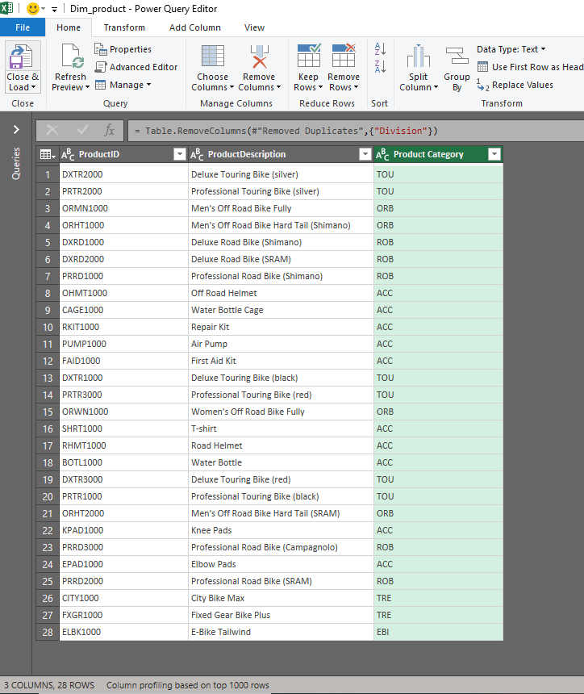

# 📊  WTF-Sales-Analysis

This project explores and visualizes sales performance data for two countries (Germany and United States) across multiple years and regions using Excel. The dataset includes detailed transaction records such as revenue, sales quantity, cost of goods manufactured (COGM), discounts, and customer information from Germany and the United States.

---
## 🧠 Table of Contents
- [Project Context](#project-context)
- [Key Questions](#key-questions)
- [Dataset Description](#dataset-description)
- [Data Cleaning & Preparation](#data-cleaning--preparation)
- [Visuals & Dashboard](#visuals--dashboard)
- [Tools Used](#tools-used)
- [Author](#author)
- [License](#license)
---

## 🧩 Project Context

**Industry**: Fintech & Sales Analytics
**Role**: Junior Data Analyst
**Tools Used**: Microsoft Excel (Pivot Tables, Charts, Slicers, Conditional Formatting, KPI Cards)

---

## 🎯 Key Questions

This project explores sales data to uncover trends, performance patterns, and seasonality insights across multiple years. It is divided into two main sections: A (Country Analysis) and B (Product Performance Analysis).

**Section A** — Country Sales Trends

1. Revenue Behavior: Highlight the sales revenue trend of the two countries over the years.

2. Pattern Analysis: Identify possible reasons for the observed sales behavior using evidence from the data.

3. Crisis Impact: Excluding Silicon Valley Bikes, compare monthly sales revenue year-over-year and relate the findings to the 2008 Lehman Brothers financial crisis.

**Section B** — Product Performance & Seasonality

1. Flop Product: Determine the product with the lowest sales quantity each year.

2. Top Seller: Identify which product category generated the highest revenue each year.

3. Category Contribution: Calculate what percentage the Off-Road Bikes category contributed to total bicycle sales.

4. Seasonal Behavior Case Study: Examine whether bicycles and accessories show expected seasonality patterns (higher sales in spring/summer). Identify any products that lack seasonality and support findings with temporal charts.

---

## 🗂️ Dataset Description

**Total Records**: 48,384
**Columns**: 23

Each row in the dataset represents a single sales transaction, detailing the customer, product, and financial performance of each sale across different regions and time periods.

This dataset was provided as part of a data analysis skill assessment project, designed to test the ability to identify, clean, and use the most relevant fields for accurate analysis and reporting. Specifically, it includes duplicate financial columns — one set in mixed currencies and another converted to U.S. dollars (USD).

**Fields included**:

YEAR, MONTH, DAY: Transaction date details used for temporal and seasonal analysis.

Customer / CustomerDescr: Unique customer ID and descriptive name.

City / Country / Salesorg: Location and organization of the sale.

OrderNumber / OrderItem: Unique identifiers for each sales order and line item.

Product / ProductDescr / Product Category: Product identifiers and descriptive details.

Division: Department or category under which the product is sold.

SalesQuantity: Number of units sold per transaction.

UnitOfMeasure: Unit in which the quantity is measured (e.g., pcs).

Revenue (Mixed Currency): Original sales amount in various currencies.

Revenue (USD): Converted sales amount standardized in U.S. dollars — used for analysis.

Discount (Mixed Currency) / Discount (USD): Discount amounts before and after conversion to USD.

CostOfGoodsManufactured (Mixed Currency) / CostOfGoodsManufactured (USD): Product manufacturing or procurement cost in both original and USD values.

Currency: Indicates the original currency before conversion.

**Note**:
All analyses, visualizations, and insights in this project are based on the USD-converted columns (Revenue USD, Discount USD, and COGM USD) to ensure consistency and comparability across countries.

---

## 🧹 Data Cleaning & Preparation

I performed all the cleaning and setup in Excel before moving into analysis. Here’s what I worked on:

First, I cleaned the table, promoted the first row to headers, and ensured each column had the correct data type.

I combined the Year, Month, and Day columns into a single Date column to support trend analysis over time.

Added new time-based fields — Month Name, Day Name, and Quarter of the Year — to enhance temporal insights.

Created four dimension tables (dim_calendar, dim_country, dim_customer, dim_product) and one Fact table.

Removed duplicates from all dimension tables to maintain data integrity.

For the Fact table, I used the USD columns for Revenue, Discount, and COGM, since they were the standardized versions of the mixed-currency values.

Finally, I established proper relationships between tables using the correct primary keys in the model view.

---

## 📸 Visuals & Dashboard

**1️⃣ Dashboard Overview**
  

  
**2️⃣ Sales Table – Before Cleaning**
  

  
**3️⃣ Sales Table – After Cleaning**
  

  
**4️⃣ Fact table**
  

  
**5️⃣ Calendar Table (Dimension)**
  

  
**6️⃣ Country table (Dimension)**
  

  
**7️⃣ Customer table  (Dimension)**
  

  
**8️⃣ Product table (Dimension)**
  

  
